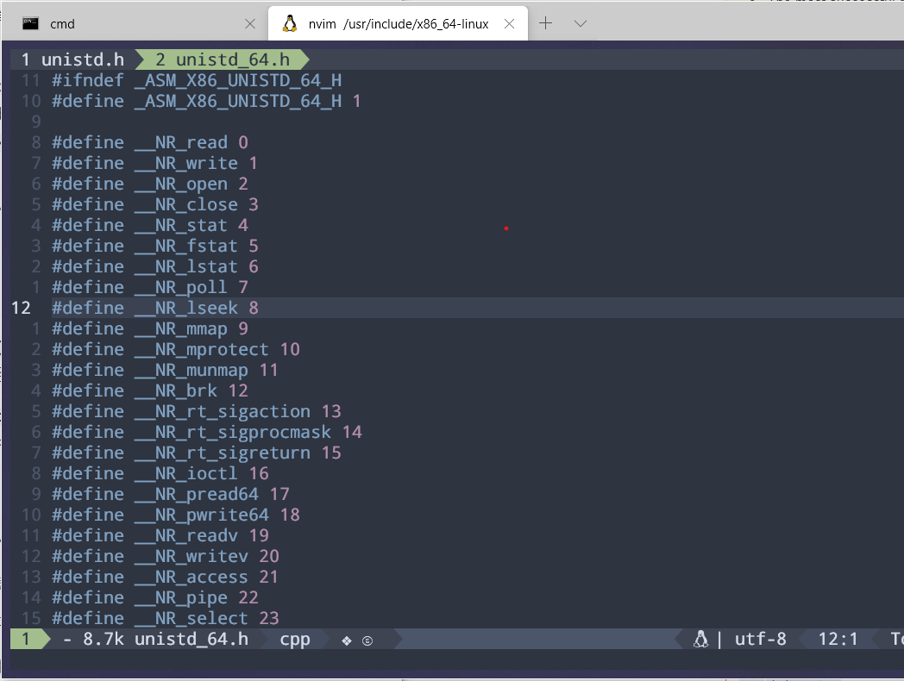

# 与操作系统打交道

**译者注：**

原文地址：[Communicating with the operating system](https://cfsamson.github.io/book-exploring-async-basics/3_1_communicating_with_the_os.html#communicating-with-the-operating-system)

**本章节要研究的内容：**

- 什么是系统调用
- 抽象层
- 编写底层跨平台时面临的挑战

## 系统调用入门知识
我们（的程序）与操作系统之间依靠`系统调用`进行交互。系统调用就是操作系统提供的公共API，我们在编写在”用户态“的应用，通过这些API来与操作系统进行交互。

大多数情况下，这些系统调用都是编程语言或者运行时环境抽象出来的。接下来看到的像Rust这样的语言将`系统调用`抽象得很简单。

`系统调用`是你正在与之通信的内核的一个特例，UNIX家族的内核有很多相似之处。类Unix系统通过`libc`来展示所有的系统调用。

另一方面，Windows则使用自己的API，通常被称为WinAPI，而且与基于UNIX的系统的实现方式截然不同。

大多数情况下，尽管有一种方法可以达到同样的效果。`epoll`、`kqueue`、`IOCP`在功能层面上可能没有太大的区别，但特别是当我们深入研究时，这三者在功能的具体实现上的做法就不尽相同了。

## 系统调用的例子

为了更加熟悉`系统调用`，我们在`BSD(MacOS)`、`Linux`和`Windows`这三个系统架构上都实现了一个很简单的系统调用。接下来也将看到在三种抽象层次上的具体实现。

我们要实现的`系统调用`用于我们要向`stdout`写入一些内容的时候。因为这是一个被广泛使用的操作，看看它底层是如何实现的应该会很有趣。

### 最低层次的抽象

为此，我们需要编写一些[内联汇编代码](https://doc.rust-lang.org/1.0.0/book/inline-assembly.html)。我们将从我们写进CPU的指令开始说起。

> 如果你想要了解更多的内联汇编代码，我推荐你看一下[我之前一本书的相关章节](https://cfsamson.gitbook.io/green-threads-explained-in-200-lines-of-rust/an-example-we-can-build-upon) 

既然处于抽象层的最底层，我们就要为三个平台各自写不同的代码。

在Linux和MacOS上，我们要使用的`系统调用`为`write`。这两个系统都是基于`文件描述符`的概念运行的，而`stdout`一种特殊的文件描述符，在启动进程时就已经存在。

**在Linux上调用`write`大致就是像下面这样**

(你可以点击右上角的“Play”来运行这个例子)

```rust
#![feature(asm)]
fn main() {
    let message = String::from("Hello world from interrupt!\n");
    syscall(message);
}

#[cfg(target_os = "linux")]
#[inline(never)]
fn syscall(message: String) {
    let msg_ptr = message.as_ptr();
    let len = message.len();
    
    unsafe {
        asm!("
        mov     $$1, %rax   # system call 1 is write on linux
        mov     $$1, %rdi   # file handle 1 is stdout
        mov     $0, %rsi    # address of string to output
        mov     $1, %rdx    # number of bytes
        syscall             # call kernel, syscall interrupt
    "
        :
        : "r"(msg_ptr), "r"(len)
        : "rax", "rdi", "rsi", "rdx"
        )
    }
}
```

在Linux上启动`write`这个系统调用对应序号为`1`，所以`$$1`就表示我们把数值1的写入寄存器`rax`

> 在使用AT&T语法的内联汇编代码中，`$$`用于指代你所写的字面值。而单个`$`用于指代一个参数，所以当我们写`$0`时，指的就是`msg_ptr`也就是第一个参数。我们还要给出一个clobber list` : "rax", "rdi", "rsi", "rdx"`，标记写入过的寄存器，以便编译器能够知道我们正在修改寄存器的内容，所以这些寄存器内部的值是不可靠的。

往寄存器寄存器`rdi`要写入的值也是数值`1`，这个`1`指代我们要write的对象/文件，其对应的文件描述符为`1`。这个`1`和`write`的系统调用编号`1`没有任何关联，仅仅是个巧合。

译者注：x64系统的系统调用号的对应关系如下：



接着我们将字符串缓冲区地址和缓冲区长度分别写入寄存器`rsi`与寄存器`rdx`，然后调用`syscall`指令。

> `syscall`指令是一个较新的指令。在`x86`体系结构早期的32位系统上，需要通过发出软中断`int 0x80`来执行系统调用。软中断在当前我们所在的抽象层级上是很慢的，所以之后又单独加入了一个名为`syscall`的指令。`syscall`指令使用了[VDSO](http://articles.manugarg.com/systemcallinlinux2_6.html)，这是一个附加到每个进程内存中的内存页，执行系统调用时不需要上下文切换（从用户态切换为内核态）。

**在MacOS中，系统调用看起来就像是这样：** \

(因为Rust playground运行在Linux上，所以我们不能在这里跑示例程序）

```rust, no_run
#![feature(asm)]
fn main() {
    let message = String::from("Hello world from interrupt!\n");
    syscall(message);
}

#[cfg(target_os = "macos")]
fn syscall(message: String) {
    let msg_ptr = message.as_ptr();
    let len = message.len();
    unsafe {
        asm!(
            "
        mov     $$0x2000004, %rax   # system call 0x2000004 is write on macos
        mov     $$1, %rdi           # file handle 1 is stdout
        mov     $0, %rsi            # address of string to output
        mov     $1, %rdx            # number of bytes
        syscall                     # call kernel, syscall interrupt
    "
        :
        : "r"(msg_ptr), "r"(len)
        : "rax", "rdi", "rsi", "rdx"
        )
    };
}
```

正如你所见，这段代码和Linux下的差别并不是那么大，除了系统调用`write`对应的编号从`1`改成了`0x2000004`。

**那么Window平台要咋整呢**

上面的代码中的方式并不是一种优雅的实现。

诚如你所见，如果你要编写一个长期运行的程序，你需要知晓操作系统提供了哪些保证。据我所知，Linux和MacOS都给出了某些保证，比如`$$0x2000004`在MacOS总是指向`write`这个系统调用（虽然我不确定这些保证有多可信）。而当涉及到这样的底层内部设定时，Windows不提供任何保证。

Windows屡次更改这些内部设定，也没有提供官方的文档。我们能拿到的唯一的资料就是 像[这样](https://j00ru.vexillium.org/syscalls/nt/64/)的一份逆向工程表。这就意味着这个版本的`write`可能在下次版本更新后就变成`delete`了。

## 下一层次（高一层次）的抽象

下一层次的抽象是直接使用三大操作系统提供的API

其实我们已经看到了这一层次的抽象帮我们省了一些代码，因为刚好对于这个特定的例子而言，Linux和MacOS的系统调用是一致的，所以我们只需要对Windows做特殊处理，也就是使用形如`#[cfg(not(target_os = "windows"))]` 的条件编译标志。而对于Windows的系统调用代码，我们就用`#[cfg(target_os = "windows")]`这样相反的标志。

### 在Linux和MacOS下使用操作系统提供的API

你可以直接在这个窗口中运行这段代码。但是，Rust playground运行在Linux，所以如果你想要在Windows上运行这段代码，那么你需要把这段代码拷贝到Windows本地运行。

**我们的系统调用代码现在长这样**\
（你可以直接在这运行代码。对于Linux和MacOS都有效）

```rust
use std::io;

fn main() {
    let sys_message = String::from("Hello world from syscall!\n");
    syscall(sys_message).unwrap();
}

// and: http://man7.org/linux/man-pages/man2/write.2.html
#[cfg(not(target_os = "windows"))]
#[link(name = "c")]
extern "C" {
    fn write(fd: u32, buf: *const u8, count: usize) -> i32;
}

#[cfg(not(target_os = "windows"))]
fn syscall(message: String) -> io::Result<()> {
    let msg_ptr = message.as_ptr();
    let len = message.len();
    let res = unsafe { write(1, msg_ptr, len) };

    if res == -1 {
        return Err(io::Error::last_os_error());
    }
    Ok(())
}

```

接下来，我来解释一下我们具体做了什么。`main`函数应该不需要解释了。


```rust, no_run
#[link(name = "c")]
```

所有的Linux都会附带某个版本的`libc`，这是一个C的函数库，用来与操作系统通信。采用`libc`加上其接口保持不变的方式，开发人员就可以在不破坏上层使用者代码的情况下更改底层实现。这个标志告诉编译器连接到我们编译所在系统的"c"库。

```rust, no_run
extern "C" {
    fn write(fd: u32, buf: *const u8, count: usize);
}
```

`extern "C"` 或者只有`extern`（如果没有指定，默认是C）表示我们会把特定的函数链接到“c”的函数库，并且使用“C"语言的函数调用约定。之后你会看到，在Windows，我们需要修改此处，因为Windows使用了与*nix系统不同的调用约定

链接和被链接的函数的名称需要保持一致，在这里就是`write`。虽然不要求参数的命名保持一致，但是必须保证顺序一致（也就是参数类型一一对应），而推荐的做法是保持参数命名与他们在链接库中的命名一致。

write函数接收一个`文件描述符`，在本例中这个文件描述符是`stdout`的句柄。另外，write函数还需要我们给出一个指针，指向`u8`类型元素的数组，和这段数组（缓冲区）的长度。

```rust, no_run
#[cfg(not(target_os = "windows"))]
fn syscall_libc(message: String) {
    let msg_ptr = message.as_ptr();
    let len = message.len();
    unsafe { write(1, msg_ptr, len) };
}
```
首先，我们拿到了指向字符串底层缓冲区的指针，这是一个与`buf`参数匹配的、类型为`*const u8`的指针。而变量`len`指示缓冲区的大小，对应`count`参数。

你可能会好奇我们怎么知道`1`是`stdout`对应的文件句柄，以及我们是如何找到这个值的。

当用Rust调用系统调用函数时，你会经常注意到这一点。通常，常量被定义在rust无法链接的C的头文件里，所以需要开发者在对应的头文件中自行搜索（当然你也可以使用搜索引擎，也推荐使用程序包`libc`）。1始终是UNIX系统上对应`stdout`的文件描述符。

> rust中名为[libc](https://github.com/rust-lang/libc)的程序包就是封装了`libc`里的函数，还提供了上述的常量，之后你会看到我们使用这个包里的函数。

在rust中，调用FFI(Foreign Function Interface)函数被认为是不安全的，所以我们需要使用关键词`unsafe`。

### 在Windows下使用系统调用的API

**在Windows使用这个系统调用** \
(如果要尝试运行示例代码，你需要将代码拷贝到Windows机器上)

```rust, no_run
use std::io;

fn main() {
    let sys_message = String::from("Hello world from syscall!\n");
    syscall(sys_message).unwrap();
}

#[cfg(target_os = "windows")]
#[link(name = "kernel32")]
extern "stdcall" {
    /// https://docs.microsoft.com/en-us/windows/console/getstdhandle
    fn GetStdHandle(nStdHandle: i32) -> i32;
    /// https://docs.microsoft.com/en-us/windows/console/writeconsole
    fn WriteConsoleW(
        hConsoleOutput: i32,
        lpBuffer: *const u16,
        numberOfCharsToWrite: u32,
        lpNumberOfCharsWritten: *mut u32,
        lpReserved: *const std::ffi::c_void,
    ) -> i32;
}

#[cfg(target_os = "windows")]
fn syscall(message: String) -> io::Result<()> {

    // let's convert our utf-8 to a format windows understands
    let msg: Vec<u16> = message.encode_utf16().collect();
    let msg_ptr = msg.as_ptr();
    let len = msg.len() as u32;

    let mut output: u32 = 0;
        let handle = unsafe { GetStdHandle(-11) };
        if handle  == -1 {
            return Err(io::Error::last_os_error())
        }

        let res = unsafe {
            WriteConsoleW(handle, msg_ptr, len, &mut output, std::ptr::null())
            };
        if res  == 0 {
            return Err(io::Error::last_os_error());
        }

    assert_eq!(output as usize, len);
    Ok(())
}
```

现在让我们看看上面的代码，诚如你所见，变得复杂了一些，但是我们会花一点时间一行一行地过一下代码。

```text
#[cfg(target_os = "windows")]
#[link(name = "kernel32")]
```

第一行的代码是告诉编译器仅当目标系统`target_os`为Windows时，才编译这部分代码。

第二行是链接指令，告诉链接器我们要链接kernel32库（你可能在其他代码中看到链接的是`user32`库，那也是可行的。）


```rust, no_run
extern "stdcall" {
    /// https://docs.microsoft.com/en-us/windows/console/getstdhandle
    fn GetStdHandle(nStdHandle: i32) -> i32;
    /// https://docs.microsoft.com/en-us/windows/console/writeconsole
    fn WriteConsoleW(
        hConsoleOutput: i32,
        lpBuffer: *const u16,
        numberOfCharsToWrite: u32,
        lpNumberOfCharsWritten: *mut u32,
        lpReserved: *const std::ffi::c_void,
    ) -> i32;
}
```

首先，`extern "stdcall"`告诉编译器，我们不使用`C`的函数调用约定，而是使用Windows的调用约定，也就是`stdcall`。

下一个部分是我们想要链接的函数。在Windows下，我们需要链接2个函数：`GetStdHandle`和`WriteConsoleW`。

`GetStdHandle` 用于拿到一个标准设备的引用，比如`stdout`。

`WriteConsole` 有两种形式, `WriteConsoleW` 接收Unicode 字符串，而`WriteConsoleA` 接收ANSI编码的字符串。

如果你只写入英文字符串，那么使用ANSI编码字符串对应的函数,即`WriteConsoleA`也是可行的，但你如果要写入其他语言的字符串，可能会用到特定的字符（`ANSI`无法表示，可能是`utf-8`编码），会导致程序崩溃。

这就是为什么我们要把`utf-8`编码的字符串转成`utf-16`编码的Unicode码点，用于字符串的表示，并且使用`WriteConsoleW`函数。

> 译者注：
>
> 简单来说，码点(code point)就是某个字符在Unicode字符集对应的那个数，比如字母A对应的码点就是`U+0041`。
>
> 如果你对字符串编码感兴趣，可以看看这篇文章：[The Absolute Minimum Every Software Developer Absolutely, Positively Must Know About Unicode and Character Sets (No Excuses!)](https://www.joelonsoftware.com/2003/10/08/the-absolute-minimum-every-software-developer-absolutely-positively-must-know-about-unicode-and-character-sets-no-excuses/)

```rust, no_run, noplaypen
#[cfg(target_os = "windows")]
fn syscall(message: String) -> io::Result<()> {

    // let's convert our utf-8 to a format windows understands
    let msg: Vec<u16> = message.encode_utf16().collect();
    let msg_ptr = msg.as_ptr();
    let len = msg.len() as u32;

    let mut output: u32 = 0;
        let handle = unsafe { GetStdHandle(-11) };
        if handle  == -1 {
            return Err(io::Error::last_os_error())
        }

        let res = unsafe {
            WriteConsoleW(handle, msg_ptr, len, &mut output, std::ptr::null())
            };

        if res  == 0 {
            return Err(io::Error::last_os_error());
        }

    assert_eq!(output, len);
    Ok(())
}
```
首先我们把字符串转换成Windows使用的utf-16编码的字符串。Rust恰好已经有内置函数能够将`utf-8`编码的字符串转换成`utf-16`的码点。`encode_utf16`方法返回一个指向`u16`码点的迭代器，通过这个迭代器我们可以拿到一个`Vec`。

```rust, no_run, noplaypen
let msg: Vec<u16> = message.encode_utf16().collect();
let msg_ptr = msg.as_ptr();
let len = msg.len() as u32;
```

接着，我们拿到`Vec`底层缓冲区的指针和缓冲区的长度。

```rust, no_run, noplaypen
let handle = unsafe { GetStdHandle(-11) };
   if handle  == -1 {
       return Err(io::Error::last_os_error())
   }
```

接下来调用`GetStdHandle`。我们传入参数`-11`。这个参数的取值与不同标准设备的映射关系记录在`GetStdHandle`的文档中。

|Handle|Value|
|------|-----|
|Stdin|-10|
|Stdout|-11|
|StdErr|-12|

我们很幸运，因为一般情况下，很少能在对应函数文档中方便地找到这种映射信息。

所有函数的返回代码都有详尽的文档记录，所以我们在这里处理潜在错误的方式将与在Linux/MacOS下保持一致。

```rust, no_run
let res = unsafe {
    WriteConsoleW(handle, msg_ptr, len, &mut output, std::ptr::null())
    };

if res  == 0 {
    return Err(io::Error::last_os_error());
}
```

下一步就是调用`WriteConsoleW`函数。这步没有什么特别的内容。

### 最高层次的抽象

这层就很简单了，大多数标准库都会提供这一层次的函数抽象。在Rust里就是：

```rust
println!("Hello world from Stdlib");
```

# 最终版本的跨平台系统调用代码

```rust
use std::io;

fn main() {
    let sys_message = String::from("Hello world from syscall!\n");
    syscall(sys_message).unwrap();
}

// and: http://man7.org/linux/man-pages/man2/write.2.html
#[cfg(not(target_os = "windows"))]
#[link(name = "c")]
extern "C" {
    fn write(fd: u32, buf: *const u8, count: usize) -> i32;
}

#[cfg(not(target_os = "windows"))]
fn syscall(message: String) -> io::Result<()> {
    let msg_ptr = message.as_ptr();
    let len = message.len();
    let res = unsafe { write(1, msg_ptr, len) };

    if res == -1 {
        return Err(io::Error::last_os_error());
    }
    Ok(())
}

#[cfg(target_os = "windows")]
#[link(name = "kernel32")]
extern "stdcall" {
    /// https://docs.microsoft.com/en-us/windows/console/getstdhandle
    fn GetStdHandle(nStdHandle: i32) -> i32;
    /// https://docs.microsoft.com/en-us/windows/console/writeconsole
    fn WriteConsoleW(
        hConsoleOutput: i32,
        lpBuffer: *const u16,
        numberOfCharsToWrite: u32,
        lpNumberOfCharsWritten: *mut u32,
        lpReserved: *const std::ffi::c_void,
    ) -> i32;
}

#[cfg(target_os = "windows")]
fn syscall(message: String) -> io::Result<()> {

    // let's convert our utf-8 to a format windows understands
    let msg: Vec<u16> = message.encode_utf16().collect();
    let msg_ptr = msg.as_ptr();
    let len = msg.len() as u32;

    let mut output: u32 = 0;
        let handle = unsafe { GetStdHandle(-11) };
        if handle  == -1 {
            return Err(io::Error::last_os_error())
        }

        let res = unsafe {
            WriteConsoleW(handle, msg_ptr, len, &mut output, std::ptr::null())
            };

        if res  == 0 {
            return Err(io::Error::last_os_error());
        }

    assert_eq!(output, len);
    Ok(())
}
```
