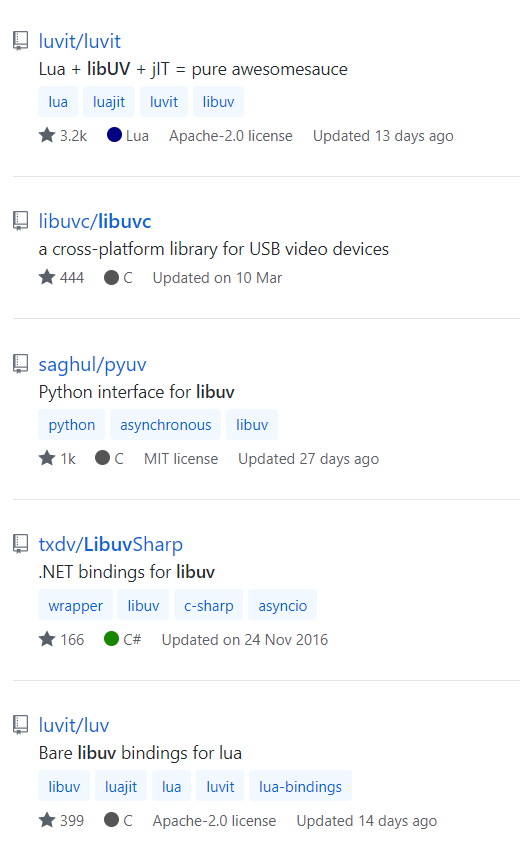

# Epoll, Kqueue与IOCP

一些知名的库在Linux、Mac和Windows上分别使用Epoll、Kqueue和IOCP，从而实现跨平台事件队列。

Node运行时的一部分是基于[libuv](https://github.com/libuv/libuv)的。libuv是一个跨平台的异步I/O库。`libuv`还是[Julia](https://julialang.org/)和[Pyuv](https://github.com/saghul/pyuv) 创建跨平台事件队列的基石；大多数的语言都对应地实现了对libuv的绑定。

在Rust中我们可以使用[mio - Metal IO](https://github.com/tokio-rs/mio)。`Mio`为[Tokio](https://github.com/tokio-rs/tokio)提供了操作系统级别的事件队列。

Tokio是一个提供I/O、网络、调度等功能的运行时。`Mio`之于`Tokio`就像`libuv`之于`Node`。

`Tokio`为许多Web框架提供了支持，其中包括有名的高性能框架[Actix Web](https://github.com/actix/actix-web)。

既然我们想要理解一切是如何运作的，我决定自己搭建一个极简版本的事件队列。由于灵感大部分源于`mio`，所以我决定将其命名为`minimio`。

> 我已经在[Epoll, Kqueue and IOCP explained](https://cfsamsonbooks.gitbook.io/epoll-kqueue-iocp-explained/)一书中详细描述了它是如何工作的。我们还构建了一个事件循环，而我们也拿它作为本书中跨平台的事件循环。有兴趣的话，你可以访问 [Github repository ](https://github.com/cfsamson/examples-minimio)查看代码。

尽管如此，我们还是会在此对它们进行简单的介绍，以便你能了解大概内容。

## 为什么要使用系统支持的事件队列？

之前的章节中我们已经谈到：我们需要与操作系统紧密合作，从而尽可能提高I/O操作的效率。诸如Linux、MacOS和Windows这样的操作系统都提供了好几种阻塞和非阻塞的执行I/O操作的方式。

阻塞操作对于程序员而言最不灵活的，因为我们需要把控制权交给操作系统，然后操作系统挂起线程。最大的优点是，一旦我们等待的事件准备完毕，线程就会被唤醒。

非阻塞方式会相对更加灵活，但是需要有一种方式来告知我们任务是否已经完成了。这通常是通过返回某种类型的数据完成的，这些数据会表明任务是`Ready`还是`NotReady`。缺点就是，我们需要定期地检查状态，以便能够判断状态是否发生改变。

基于Epoll/kqueue/IOCP的事件队列是第三种方式，它结合了非阻塞方式的灵活性，同时避免了前面提到的缺点。

> 我们不会讨论`poll`和`select`的方式，不过如果你想了解它们以及它们与`epoll`的区别的话，可以看看这篇[文章](http://web.archive.org/web/20190112082733/https://people.eecs.berkeley.edu/~sangjin/2012/12/21/epoll-vs-kqueue.html)。

## 基于准备情况的事件队列（Readiness-based event queues）

Epoll和Kqueue被称为基于准备情况的事件队列，意思就是这两种事件队列会在一项操作能够被执行之时通知你，比如一个socket准备好被读取的时候。

**使用epoll/kqueue从socket里读取数据的大致步骤：**

1. 调用名为`epoll_create`或`kqueue`的系统调用，创建一个事件队列。
3. 向操作系统申请一个套接字的文件描述符。
6. 通过另一个系统调用，注册对该socket的`Read`事件的兴趣。我们还需要告知操作系统，当（1）中创建的事件队列中的事件就绪时，我们希望收到通知。
8. 下一步，我们调用`epoll_wait`或者`kevent`，等待一个事件准备完毕。这个操作会阻塞（挂起）调用该函数的线程。
9. 当事件准备就绪，我们的线程就会被恢复（不再阻塞），并且调用的“wait”函数会返回就绪事件的信息。
11. 调用`read`，读取套接字的数据。

## 基于完成情况的事件队列（Completion-based event queues）

IOCP，即I/O Complete Ports（I/O完成端口），是一种基于完成情况的事件队列。这种类型的事件队列会在事件完成时通知你，比如在数据已经被写入缓冲区后。

以下是这种类型的事件队列的大致分解步骤：

1. 通过调用`CreateIoCompletionPort`，创建一个事件队列。
3. 创建一段缓冲区，并且向操作系统申请一个socket的句柄。
6. 调用另一个系统调用，注册对该socket的`Read`事件的兴趣，与上面不同的是，我们还会传入(2)中创建的缓冲区，用于存放读取到的数据。
4. 下一步，我们调用`GetQueuedCompletionStatusEx`，这个函数会一直阻塞，直到有一个事件完成。
10. 我们的线程恢复运行（不再阻塞），而缓冲区中已经填充了我们所感兴趣的数据了。

## Epoll

`Epoll`是Linux下实现事件队列的方式。`Epoll`在功能上与`Kqueue`有许多共通之处。相较于Linux平台下其他类似方法（如`select`、`poll`），`epoll`的优势在于它能够非常高效地处理大量事件。

### Kqueue

`Kqueue`是MacOs下实现事件队列的方式，它起源于BSD，存在于诸如FreeBSD、OpenBSD等操作系统中。`Kqueue`在功能上与`Epoll`相似，但是实际使用时有所不同。

有一些人会认为它使用起来更复杂、更抽象。

### IOCP

`IOCP`/完成端口，是Windows下实现事件队列的方式。

`完成端口`会在事件`完成`时通知你。现在听起来好像与之前两种差别不大，但事实上，非也。当你想编写一个库的时候，差别就会非常显著。因为对二者进行抽象意味着你要么将`IOCP`抽象为`readiness-base`，要么将`epoll/kqueue`抽象为`completion-based`的。

将缓冲区”借给“操作系统带来的风险：缓冲区在等待操作返回（例子中是读取）时，需要保证缓冲区不变。

> 根据我的经验，将`readiness-based`的I/O模型抽象为类似`completion-based`的模型要比反过来做要简单。这意味着你应该先让IOCP的部分先运行起来，再尝试适配`epoll`或者`kqueue`。
